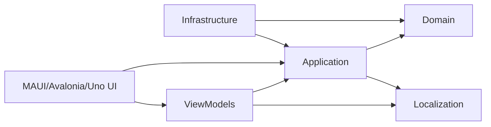

# 🥞 CrepeDuChef


---

## 🎯 Concept & Fun

**CrepeDuChef** est une application multi‑UI .NET (MAUI + Avalonia) qui répond à une question essentielle :

> Qui aura la crêpe du chef ?

La dernière crêpe est souvent :
- plus petite  
- difforme  
- mais étrangement… la plus convoitée  

L’application sélectionne équitablement et aléatoirement le prochain chef grâce à un algorithme de rotation garantissant que tout le monde passe à tour de rôle.

L’historique est stocké en SQLite, assurant une rotation juste au fil des sessions.
> Une version avec MinimalApi Webservice est prévue

---

## 🎯 Objectifs techniques & bonnes pratiques mises en œuvre

Au‑delà du côté fun du projet, l’objectif est de mettre en pratique des standards professionnels de développement moderne.  
Ce repository me sert de terrain d’expérimentation pour appliquer des concepts que j’utilise ou que je souhaite renforcer dans un contexte réel.

### 🧱 Architecture & organisation du code
- Mise en place d’une **Clean Architecture** stricte (Domain / Application / Infrastructure / UI).
- Séparation claire des responsabilités et dépendances unidirectionnelles.
- Utilisation de **DTOs**, **mappers**, **services applicatifs**, et **entités métier** isolées.
- Respect des principes **SOLID**, en particulier SRP et DIP.

### 🗄️ Données & persistance
- Utilisation d’**Entity Framework Core** avec migrations propres et modèle maîtrisé.
- Conception d’un modèle pensé pour la **synchronisation multi‑device** (OriginDeviceId, UpdatedAt, DeletedAt).
- Repositories testables et découplés de la logique métier.

### 🧪 Qualité & testabilité
- Tests unitaires structurés avec **NSubstitute** et providers mockés (DeviceId, DateTime).
- Tests déterministes grâce à l’injection systématique des dépendances temporelles et contextuelles.
- Préparation à des tests d’intégration SQLite pour valider le pipeline complet.

### 🌍 Localisation & UI
- Gestion propre de la **localisation** (IStringLocalizer).
- UI MAUI + Avalonia avec ViewModels partagés et logique centralisée.
- Préparation à un futur **Minimal API** pour la synchronisation et la gestion multi‑famille.

### 🚀 Vision long terme
- Architecture pensée pour évoluer vers un système multi‑groupe, multi‑utilisateur, avec invitations et permissions.
- Préparation à un backend léger (Minimal API) pour la synchro offline‑first.
- Projet conçu pour être un exemple concret de bonnes pratiques .NET modernes.


---

# 🧩 Architecture

L’architecture suit une approche Clean Architecture, adaptée pour supporter plusieurs interfaces utilisateur (MAUI + Avalonia) tout en partageant un cœur métier commun.

- **Domain** : logique métier pure, sans dépendances externes  
- **Application** : cas d’usage, orchestration métier, validation  
- **Infrastructure** : EF Core, SQLite, implémentations techniques  
- **Localization** : ressources de traduction  
- **ViewModels** : logique de présentation partagée entre MAUI et Avalonia  
- **MAUI** : interface mobile + desktop  
- **Avalonia** : interface desktop multiplateforme  
- **UI Adapters** : adaptation des ViewModels aux frameworks UI  
- **Presenters** : abstraction des dialogues et interactions UI


# Diagram

Architecture inspirée de **Clean Architecture**, adaptée à MAUI.



---

# 📂 Structure du projet

Voici l’organisation générale du repository :
```
CrepeDuChef
│
├── Domain
├── Application
├── Infrastructure
├── Localization
├── ViewModels
├── Maui
├── Avalonia
└── Tests
```

---

# 🏷️ Version actuelle

**0.3.0 (pré-release)**  

Cette version consolide l’architecture du projet et introduit une base technique stable pour la suite du développement.

### 🧱 Gestion centralisée des dépendances
- **Directory.Packages.props** : centralise toutes les versions NuGet via CPM (Central Package Management).
- **Directory.Build.props** : définit les propriétés MSBuild communes (TFM, nullable, analyzers, conventions).

### 🧱 Reproductibilité de l’environnement
- **global.json** : verrouille la version du SDK .NET pour garantir des builds identiques sur toutes les machines.

### 🔧 Intégration continue
- Pipeline GitHub Actions configuré pour les branches `main` et `develop`.
- Build + tests automatisés pour assurer la stabilité du projet.

---

# 📦 Détails des projets  
Pour plus de détails techniques : voir la documentation dans
[Doc/ProjectsDetails](Docs/ProjectsDetails/ProjectsDetails.md)

--- 


## 📄 Licence

Ce projet est distribué sous la licence **MIT**.  
Le fichier `LICENSE.txt` à la racine du dépôt contient les termes complets.

---

# ⚙️ Technologies


| Tech               | Version / Usage                                             |
|--------------------|-------------------------------------------------------------|
| .NET               | **10.0** — plateforme principale (`<LangVersion>preview`)   |
| .NET MAUI          | **net10.0‑maccatalyst / android / ios / windows** — UI      |
| Avalonia           | **12.x** — UI desktop cross‑platform                        |
| EF Core            | Compatible .NET 10 — ORM + migrations                        |
| SQLite             | Stockage local                                              |
| SkiaSharp          | Rendu graphique (MAUI / Avalonia)                           |
| xUnit              | Tests unitaires                                             |
| FluentAssertions   | Assertions avancées dans les tests                          |
| NSubstitute        | Mocking dans les tests                                      |
| FluentValidation   | Validation des DTOs                                         |
| Ressources .resx   | Localisation multi‑langue                                   |


---

# 🚀 Build & Run

1. Ouvrir la solution :

```
CrepeDuChef.slnx
```

## Maui
2. Définir comme projet de démarrage:

```
CrepeDuChef.Maui
```

3. Lancer sur la plateforme souhaitée :
- Windows  
- Android  
- iOS (non testé)  
- MacCatalyst (non testé)

## Avalonia
2b. Définir comme projet de démarrage:

```
CrepeDuChef.Avalonia
```
3.Lancer

---

# 🧪 Exécuter les tests

```
dotnet test
```

Couvre :
- Algorithme de rotation  
- Services applicatifs  
- Mappers  
- Validators  

---

# 🛣 Roadmap

- [ ] API Web pour synchronisation multi-appareils  
- [ ] Ajout d’autres tests  
- [ ] Amélioration UI/UX  
- [ ] Ajout d'une version Uno

---

# 🍺 Support

Si ce projet t’a amusé ou inspiré :

**offre-moi une bière ou une pizza** 🍺🍕


