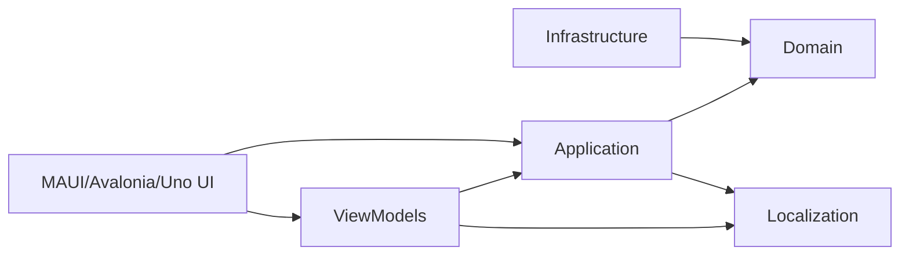

# 🥞 CrepeDuChef


---

## 🎯 Concept & Fun

**CrepeDuChef** est une application multi‑UI .NET (MAUI + Avalonia) qui répond à une question essentielle :

> Qui aura la crêpe du chef ?

La dernière crêpe est souvent :
- plus petite  
- difforme  
- mais étrangement… la plus convoitée  

L’application sélectionne équitablement et aléatoirement le prochain chef grâce à un algorithme de rotation garantissant que tout le monde passe à tour de rôle.

L’historique est stocké en SQLite, assurant une rotation juste au fil des sessions.
> Une version avec MinimalApi Webservice est prévue

---

# 🧩 Architecture

L’architecture suit une approche inspirée de Clean Architecture, adaptée pour supporter plusieurs interfaces utilisateur (MAUI + Avalonia) tout en partageant un cœur métier commun.

- **Domain** : logique métier pure, sans dépendances externes  
- **Application** : cas d’usage, orchestration métier, validation  
- **Infrastructure** : EF Core, SQLite, implémentations techniques  
- **Localization** : ressources de traduction  
- **ViewModels** : logique de présentation partagée entre MAUI et Avalonia  
- **MAUI** : interface mobile + desktop  
- **Avalonia** : interface desktop multiplateforme  
- **UI Adapters** : adaptation des ViewModels aux frameworks UI  
- **Presenters** : abstraction des dialogues et interactions UI


# Diagram

Architecture inspirée de **Clean Architecture**, adaptée à MAUI.



---

# 📂 Structure du projet

Voici l’organisation générale du repository :
```
CrepeDuChef
│
├── Domain
├── Application
├── Infrastructure
├── Localization
├── ViewModels
├── Maui
├── Avalonia
└── Tests
```

---

# 🏷️ Version actuelle

**0.3.0 (pré-release)**  
Architecture multi‑UI (MAUI + Avalonia 12) avec ViewModels partagés.  

### 🧱 Directory.Packages.props  
Gère les versions NuGet de manière centralisée (CPM).

### 🧱 Directory.Build.props  
Définit les propriétés MSBuild communes à tous les projets (TFM des libs, nullable, analyzers…).

### 🧱 global.json  
Verrouille la version du SDK .NET utilisée pour compiler le repo, afin d’éviter les conflits et garantir la reproductibilité.
 

---

# 📦 Détails des projets

## 🧬 Domain (`CrepeDuChef.Domain`)

Le **cœur métier pur**, sans dépendance externe.

Contient :
- Entities : `User`, `CrepesParty`
- Domain Services : `ChefRotationAlgorithm`
- ValueObjects : `ChefSelection`, etc.
- Interfaces : `IRandomProvider`, `ICrepePartyRepository`
- Exceptions : `EmptyFirstNameException`, `EmptyLastNameException`, `NoChefException`, `NoChefSelectionException`
- Extensions : `RandomExtensions`

➡️ **Aucune dépendance vers Application, Infrastructure ou MAUI**

---

## 🧠 Application (`CrepeDuChef.Application`)

La couche **cas d’usage**.  
Elle orchestre le métier et les implémentations techniques.

Contient :
- DTOs : `UserDto`, `UserDtoAdd`, `UserDtoUpdate`, `CrepesPartyDto`
- Services : `ChefManagementService`, `ChefRotationService`, `CrepePartyService`
- Orchestrator : `UserApplicationOrchestrator`
- Interfaces : `IChefManagementService`, `IChefRotationService`, `ICrepePartyService`, `IUserApplicationOrchestrator`
- Models : `CrepeDisplayItem`, `CrepePartySession`
- ValueObjects : `ChefSelectionResult`, `UserSelectionResult`, `UserFormData`, `UserOperationResult`, `OperationStatus`
- Validation : `UserDtoAddValidator`, `UserDtoUpdateValidator`
- Mappers : `UserMapper`, `CrepePartyMapper`
- Extensions : `ApplicationExtension`, `UserDtoExtension`, `UserDtoUpdateExtension`, `UserExtension`, `UserOperationResultExtensions`


➡️ **Ne dépend que du Domain**

---

## 🗄 Infrastructure (`CrepeDuChef.Infrastructure`)

La couche technique.

Contient :
- EF Core : `CrepeDbContext`, `CrepeDbContextDesignTimeFactory`
- Repositories : `CrepePartyRepository`
- Services : `DefaultRandomProvider`
- Migrations : `Init`, `SecureUserData`, `CrepeDbContextModelSnapshot`
- Extensions : `InfrastructureExtensions`, `RandomExtensions`

➡️ **Implémente les interfaces du Domain**

---
## 🌍 Localization (`CrepeDuChef.Localization`)
- `CrepePartyResources.resx` (+ `.fr`)
- `ValidationResources.resx` (+ `.fr`)
- `languages/Traduction.resx` (+ `.fr`)
---

## 🖥 ViewModels partagés (`CrepeDuChef.ViewModels`)
- ViewModels : `CrepeSessionsViewModel`, `SelectUsersDialogViewModel`, `UserEditorViewModel`, `UserSettingViewModel`
- Presenters : `IDialogPresenter`, `IUserFormPresenter`, `IUserSelectionPresenter`
---

## 🖥 MAUI (UI)

Organisation principale :

### MVVM
- ViewModels : `CrepeSessionsViewModelMauiAdapter`
- Views : `CrepeDuChefView`, `UserSettingView`, `MainPage`
- Models UI : `CrepePartyGroup`
 
### UI Logic
- Behaviors : `PulseAnimationBehavior`, `PulseManager`
- Converters : `IsTodayConverter`
- Mappers : `CrepePartySessionToGroupMapper`

### DI
- `MauiViewModelsModule`, `MauiViewsModule`, `MauiPresentersModule`, `MauiPopupsModule`, `DIValidator`

### Popups

UI/Popups/  
│  
├── Core/  
│   ├── `PopupCoordinator`  
│   └── `PopupOptionsFactory`  
├── Factories/  
│   ├── `IMessagePopupFactory`, `IUserFormPopupFactory`, `IUserSelectionPopupFactory`  
│   ├── `MessagePopupFactory`, `UserPopCommunautyFactory`, `UserSelectionPopupFactory`  
├── Presenters/  
│   ├── `MauiDialogPresenter`  
│   ├── `MauiUserFormPresenter`  
│   └── `MauiUserSelectionPresenter`  
├── ViewModels/  
│   └── `UserFormPopupViewModel`  
└── Views/  
    ├── `SelectUsersPopup`  
    ├── `TitledMessagePopup`  
    └── `UserFormPopup`
### Resources
- Fonts, Styles (`Styles.xaml`, `CrepeDuChefStyles.xaml`, `CrepeDuChefColors.xaml`)
- Images, Splash, Raw (`BingePanda.json`)

---
## 🖥 Avalonia (`CrepeDuChef.Avalonia`)
- App : `App.axaml`, `Program.cs`, `app.manifest`
- DI : `AvaloniaDialogsModule`, `AvaloniaPresentersModule`, `AvaloniaViewModelsModule`, `AvaloniaViewsModule`, `AvaloniaWindowing`, `MainWindowHolder`
- Dialogs :
  - Interfaces : `IDialog`
  - Factories : `AvaloniaMessageDialogFactory`, `AvaloniaUserFormDialogFactory`, `AvaloniaUserSelectionDialogFactory`
  - Message dialogs : `BaseMessageDialogWindow`, `BaseMessageDialogViewModel`, `MessageDialog`, `ErrorDialog`, `WarningDialog`
  - Windows : `SelectUsersDialog`, `UserEditorWindow`
  - Presenters : `AvaloniaDialogPresenter`, `AvaloniaUserFormPresenter`, `AvaloniaUserSelectionPresenter`
- Mappers : `CrepeDisplayToAvaMapper`, `CrepePartySessionToGroupMapper_Ava`
- Models UI : `CrepePartyGroup_Ava`, `CrepePartyItem_Ava`, `SelectableUser`
- Services : `DialogService`, `INavigationService`, `NavigationService`
- Styles : `ControlsStyles.axaml`
- ViewModels : `MainViewModel`, `CrepeSessionsViewModelAvaloniaAdapter`, `SelectUsersDialogViewModelAvaloniaAdapter`
- Views : `MainWindow`, `CrepeSessionsView`, `UserSettingsView`


---

## 🧪 Tests (`CrepeDuChef.Tests`)

Le projet `CrepeDuChef.Tests` contient les tests unitaires organisés par couche :

### Domain
- `ChefRotationAlgorithmTests`

### Application
- Services : `ChefManagementServiceTests`
- Mappers : `UserMapperTests`
- Validation :  
  - `UserDtoAddValidatorTests`  
  - `UserDtoUpdateValidatorTests`

### Fakes & Helpers
- Fakes : `FakeRandomProvider`, `FakeLocalizer`
- Helpers : `TestData`

### Technos :
- **xUnit**
- **FluentAssertions**
- **NSubstitute**

---

## 📄 Licence

Ce projet est distribué sous la licence **MIT**.  
Le fichier `LICENSE.txt` à la racine du dépôt contient les termes complets.

---

# ⚙️ Technologies


| Tech               | Version / Usage                                             |
|--------------------|-------------------------------------------------------------|
| .NET               | **10.0** — plateforme principale (`<LangVersion>preview`)   |
| .NET MAUI          | **net10.0‑maccatalyst / android / ios / windows** — UI      |
| Avalonia           | **12.x** — UI desktop cross‑platform                        |
| EF Core            | Compatible .NET 10 — ORM + migrations                        |
| SQLite             | Stockage local                                              |
| SkiaSharp          | Rendu graphique (MAUI / Avalonia)                           |
| xUnit              | Tests unitaires                                             |
| FluentAssertions   | Assertions avancées dans les tests                          |
| NSubstitute        | Mocking dans les tests                                      |
| FluentValidation   | Validation des DTOs                                         |
| Ressources .resx   | Localisation multi‑langue                                   |


---

# 🚀 Build & Run

1. Ouvrir la solution :

```
CrepeDuChef.slnx
```

## Maui
2. Définir comme projet de démarrage:

```
CrepeDuChef.Maui
```

3. Lancer sur la plateforme souhaitée :
- Windows  
- Android  
- iOS (non testé)  
- MacCatalyst (non testé)

## Avalonia
2b. Définir comme projet de démarrage:

```
CrepeDuChef.Avalonia
```
3.Lancer

---

# 🧪 Exécuter les tests

```
dotnet test
```

Couvre :
- Algorithme de rotation  
- Services applicatifs  
- Mappers  
- Validators  

---

# 🛣 Roadmap

- [ ] API Web pour synchronisation multi-appareils  
- [ ] Ajout d’autres tests  
- [ ] Amélioration UI/UX  
- [ ] Ajout d'une version Uno

---

# 🍺 Support

Si ce projet t’a amusé ou inspiré :

**offre-moi une bière ou une pizza** 🍺🍕


