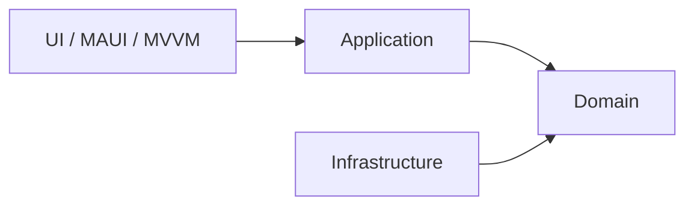

# 🥞 CrepeDuChef


---

# 🎯 Concept & Fun

**CrepeDuChef** est une application **.NET MAUI** qui répond à une question essentielle :

> **Qui aura la crêpe du chef ?**

La dernière crêpe est souvent :
- plus petite  
- difforme  
- mais étrangement… la plus convoitée  

L’application sélectionne **équitablement et aléatoirement** le prochain chef grâce à un **algorithme de rotation** garantissant que tout le monde passe à tour de rôle.

L’historique est stocké en **SQLite**, assurant une rotation juste au fil des sessions.

---

# 🧩 Architecture

Architecture inspirée de **Clean Architecture**, adaptée à MAUI.



---

# 📂 Structure du projet

```
CrepeDuChef
│
├── Domain
├── Application
├── Infrastructure
├── Maui
└── Tests
```

---

# 🏷️ Version actuelle

**0.2.0 (pré-release)**

---

# 📦 Détails des projets

## 🧬 Domain

Le **cœur métier pur**, sans dépendance externe.

Contient :
- Entities : `User`, `CrepesParty`
- Domain Services : `ChefRotationAlgorithm`
- ValueObjects : `ChefSelection`, etc.
- Exceptions métier
- Interfaces : `IRandomProvider`, `ICrepePartyRepository`

➡️ **Aucune dépendance vers Application, Infrastructure ou MAUI**

---

## 🧠 Application

La couche **cas d’usage**.  
Elle orchestre le métier et les implémentations techniques.

Contient :
- Services applicatifs  
  - `ChefManagementService`  
  - `ChefRotationService`  
  - `CrepePartyService`  
- Orchestor
  - `UserApplicationOrchestor`
- DTOs
- Mappers
- ValueObjects  
  - `OperationStatus`  
  - `UserOperationResult`  
  - `UserFormData`
- Validation (FluentValidation)
- Ressources (localisation métier)

➡️ **Ne dépend que du Domain**

---

## 🗄 Infrastructure

La couche technique.

Contient :
- EF Core  
- SQLite  
- `CrepeDbContext`
- Repositories
- Migrations
- Implémentations techniques (`DefaultRandomProvider`)

➡️ **Implémente les interfaces du Domain**

---

## 🖥 MAUI (UI)

La couche interface utilisateur.

Organisation principale :

### MVVM
- `ViewModels`
- `Views`
- `Models`

### UI Logic
- Behaviors (`PulseAnimationBehavior`, `PulseManager`)
- Converters
- Mappers

### Popups (organisation modulaire)

```
UI/Popups/
│
├── Views/
├── ViewModels/
├── Presenters/
├── Factories/
└── Models/
```

Inclut :
- `UserFormPopup`
- `UserPopupPresenter`
- `DialogPresenter`
- `DialogResult<T>`
- `DialogResultStatus`
- `DialogResultExtensions`

### Resources
- Styles
- Fonts
- Images
- Localisation (`Traduction.resx`)

➡️ **Ne dépend que de Application et Infrastructure**

---

## 🧪 Tests

Tests unitaires couvrant :

- Domain  
- Application  
- Mappers  
- Validators  
- Services  
- ViewModels  

Technos :
- **xUnit**
- **FluentAssertions**
- **NSubstitute**

---

# ⚙️ Technologies

| Tech | Usage |
|------|-------|
| .NET 10 | plateforme principale |
| .NET MAUI | UI cross-platform |
| EF Core | ORM |
| SQLite | stockage local |
| CommunityToolkit.MVVM | MVVM moderne |
| CommunityToolkit.Maui | UI helpers |
| UraniumUI | composants UI |
| SkiaSharp | rendu graphique |
| FluentAssertions | assertions |
| NSubstitute | mocking |

---

# 🚀 Build & Run

1. Ouvrir la solution :

```
CrepeDuChef.slnx
```

2. Définir :

```
CrepeDuChef.Maui
```

comme projet de démarrage.

3. Lancer sur la plateforme souhaitée :
- Windows  
- Android  
- iOS (non testé)  
- MacCatalyst (non testé)

---

# 🧪 Exécuter les tests

```
dotnet test
```

Couvre :
- Algorithme de rotation  
- Services applicatifs  
- Mappers  
- Validators  
- ViewModels  

---

# 🛣 Roadmap

- [ ] API Web pour synchronisation multi-appareils  
- [ ] Ajout d’autres tests  
- [ ] Amélioration UI/UX  
- [ ] Ajout d'une version Avalonia

---

# 🍺 Support

Si ce projet t’a amusé ou inspiré :

**offre-moi une bière ou une pizza** 🍺🍕

---

# 📜 License

MIT License  
Voir `LICENSE.txt`.
